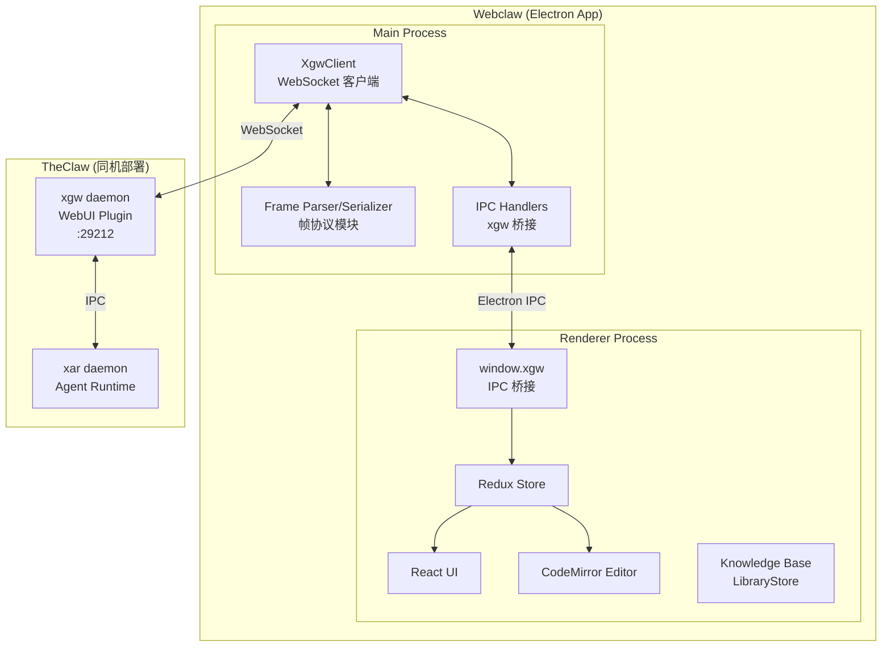

# 设计文档：Webclaw Client

## 概述

Webclaw 是将 Eidux Electron 桌面应用改造为 TheClaw agent 运行时系统桌面客户端的项目。核心改造是：移除 Eidux 内置的 AI 服务层，替换为通过 WebSocket 连接 xgw 通信网关的 webui 插件。

### 改造范围

**保留不变**：
- Electron + electron-vite 构建框架
- CodeMirror 6 Markdown 编辑器
- Redux 状态管理（doc/tab/tree/workspace/settings/ui/lib/runtime/dialog/user slices）
- 知识库系统（LibraryFactory/LibraryStore，renderer 进程 window.fs）
- 文件树、标签页、侧面板等 UI 组件
- Slash Command（/why、/explain 等纯前端 prompt 模板）
- @ Reference（知识库路径快捷方式）
- 热键、Command、Event 系统
- electron-updater 自动更新
- 多平台打包（Windows/macOS/Linux）

**移除**：
- `src/ai/node/` 全部代码（agent、llm、rag、tools、skill、server、reference、misc、context）
- `src/http/` AI HTTP 服务器代码
- `backend/` 整个目录
- `lancedb_natives/` 整个目录
- `kb/system/skills/` 和 `kb/system/prompts/`
- AI 相关 Node.js 初始化逻辑
- Supabase 相关代码
- `.github/` Eidux 特有 CI/CD 配置

**新增**：
- xgw WebSocket 客户端（Main Process）
- WebUI 帧协议解析/序列化模块
- Electron IPC 桥接层（xgw 通信）
- Agent 选择 UI
- 连接设置 UI
- Thread 浏览器
- Redux connection/agent slices

### 设计决策

| 决策 | 选择 | 理由 |
|------|------|------|
| WebSocket 客户端位置 | Main Process | 需要 Node.js 的 `ws` 库，renderer 无法直接使用 |
| 帧协议格式 | JSON over WebSocket | 与 TUI 插件一致，简单可靠 |
| 会话复用方式 | conversation_id 字段复用 | 单连接多会话，避免每个 Document 建立独立连接 |
| IPC 桥接方式 | 复用 Eidux 现有 bridge 机制 | 保持架构一致性，类型安全 |
| 帧协议模块位置 | `src/lib/webui-protocol/` | main/renderer 共享代码 |
| Agent 绑定模型 | per-document 绑定，首次发消息后锁定 | TheClaw 的 thread 归属于特定 agent，不可跨 agent 迁移。空文档可切换 agent，有聊天历史后锁定。open_conversation 帧携带 agent_id |
| conversation_id 策略 | nanoid 生成，存 frontmatter，不可变 | 与文件路径解耦，重命名/移动文档不影响会话关联，避免 eidux 时代的复杂同步逻辑 |
| Document 持久化 | 本地 .md 文件是用户侧主存储 | 用户可随时编辑修改聊天内容（加工为普通文档）。thread 是 agent 侧独立记录，两者内容可以不同 |
| 产品名称 | WebClaw（W 和 C 大写） | 对应 TheClaw 的 TUI client，作为富客户端定位 |
| WebUI Plugin 与 TUI Plugin 的关系 | 独立 plugin，不合并 | 当前协议差异虽小（仅 conversation_id 复用），但长远演化方向差异大：TUI 是轻量终端工具，webclaw 是富客户端平台，未来会扩展文件浏览、富媒体、agent 状态面板、远程文件系统等 TUI 不需要的帧类型。合并会导致大量条件分支和测试复杂度。xgw 的 plugin 架构本身就是为多 plugin 设计的，新增成本低 |

---

## 架构

### 整体架构



### 数据流

**出站（用户发送消息）**：
```
用户在 CodeMirror 输入 → Renderer dispatch sendMessage action
  → window.xgw.sendMessage(conversation_id, text)
  → IPC → Main Process
  → XgwClient 构造 message 帧（携带 conversation_id）
  → WebSocket → xgw WebUI Plugin
  → xgw 归一化为 Message → IPC → xar
```

**入站（agent 流式响应）**：
```
xar streaming → IPC → xgw WebUI Plugin
  → 构造 stream_chunk 帧（携带 conversation_id）
  → WebSocket → Main Process XgwClient
  → Frame Parser 解析
  → IPC → Renderer Process
  → Redux dispatch streamChunk action
  → CodeMirror 追加 token 到对应 Document
```

---

## 组件与接口

### 1. WebUI 帧协议（src/lib/webui-protocol/）

帧协议是 main/renderer 共享的纯数据模块，定义 Webclaw 与 xgw WebUI Plugin 之间的通信协议。

#### 帧类型定义

```typescript
// src/lib/webui-protocol/types.ts

// ── 客户端 → 服务端 ──

interface HelloFrame {
  type: 'hello'
  channel_id: string
  peer_id: string
}

interface OpenConversationFrame {
  type: 'open_conversation'
  conversation_id: string
  agent_id: string  // 指定该会话绑定的 agent
}

interface CloseConversationFrame {
  type: 'close_conversation'
  conversation_id: string
}

interface MessageFrame {
  type: 'message'
  conversation_id: string
  text: string
}

interface PingFrame {
  type: 'ping'
}

// ── 服务端 → 客户端 ──

interface HelloAckFrame {
  type: 'hello_ack'
  channel_id: string
  peer_id: string
  agents?: string[]  // 可用 agent 列表
}

interface ErrorFrame {
  type: 'error'
  code: string
  message: string
  conversation_id?: string  // 可选，关联到特定会话
}

interface StreamChunkFrame {
  type: 'stream_chunk'
  conversation_id: string
  text: string
}

interface StreamEndFrame {
  type: 'stream_end'
  conversation_id: string
}

interface ProgressFrame {
  type: 'progress'
  conversation_id: string
  kind: 'thinking' | 'tool_call' | 'tool_result' | 'ctx_usage' | 'compact_start' | 'compact_end'
  text: string
}

interface PongFrame {
  type: 'pong'
}

type ClientFrame = HelloFrame | OpenConversationFrame | CloseConversationFrame | MessageFrame | PingFrame
type ServerFrame = HelloAckFrame | ErrorFrame | StreamChunkFrame | StreamEndFrame | ProgressFrame | PongFrame
type WebUIFrame = ClientFrame | ServerFrame
```

#### 与 TUI 协议的差异

| 特性 | TUI 协议 | WebUI 协议 |
|------|---------|-----------|
| 会话模型 | 单会话（conversation_id = peer_id） | 多会话复用（显式 conversation_id） |
| 会话管理 | 无 | open_conversation / close_conversation |
| stream_chunk | 无 conversation_id | 携带 conversation_id |
| progress | 无 conversation_id | 携带 conversation_id |
| hello_ack | 无 agents 字段 | 可选返回 agents 列表 |
| error | 全局 | 可关联到特定 conversation_id |

#### 解析器与序列化器

```typescript
// src/lib/webui-protocol/parser.ts

interface ParseResult<T> {
  ok: true
  frame: T
} | {
  ok: false
  error: string
}

function parseFrame(raw: string): ParseResult<ServerFrame>
function serializeFrame(frame: ClientFrame): string
```

解析器职责：
- JSON.parse 原始字符串
- 校验 `type` 字段存在且为已知类型
- 校验各帧类型的必要字段
- 返回类型安全的帧对象或描述性错误

### 2. XgwClient（src/node/xgw/client.ts）

Main Process 中的 WebSocket 客户端，管理与 xgw WebUI Plugin 的连接。

```typescript
// src/node/xgw/client.ts

interface XgwClientConfig {
  host: string       // 默认 127.0.0.1
  port: number       // 默认 29212
  channelId: string  // 默认 webui:default
  peerId: string     // 默认 owner
}

interface XgwClientEvents {
  'connected': ()
  'disconnected': ()
  'reconnecting': (attempt: number)
  'authenticated': (agents: string[])
  'frame': (frame: ServerFrame)
  'error': (error: string)
}

class XgwClient extends EventEmitter {
  constructor(config: XgwClientConfig)
  
  connect(): void
  disconnect(): void
  
  sendMessage(conversationId: string, text: string): void
  openConversation(conversationId: string, agentId: string): void
  closeConversation(conversationId: string): void
  
  get status(): 'disconnected' | 'connecting' | 'connected' | 'authenticated' | 'reconnecting'
}
```

**连接生命周期**：
```
disconnect → connect() → connecting → [WebSocket open] → connected
  → 发送 hello → [收到 hello_ack] → authenticated
  → [WebSocket close] → reconnecting → [指数退避] → connecting → ...
  → [超过 10 次] → disconnected（通知用户）
```

**心跳机制**：
- 每 30 秒发送 ping 帧
- 收到 pong 更新 lastHeartbeat
- 连续 3 次无 pong → 关闭连接触发重连

**重连策略**：
- 指数退避：1s → 2s → 4s → 8s → ... → 60s（上限）
- 最多 10 次尝试
- 重连成功后重新发送所有已打开 Document 的 open_conversation

### 3. Electron IPC 桥接层

#### Main Process 端（src/node/xgw/bridge.ts）

```typescript
// 注册 IPC handlers，转接 renderer 请求到 XgwClient
function registerXgwIpcHandlers(client: XgwClient): void {
  // xgw:sendMessage(conversationId, text) → client.sendMessage()
  // xgw:openConversation(conversationId) → client.openConversation()
  // xgw:closeConversation(conversationId) → client.closeConversation()
  // xgw:getStatus() → client.status
  // xgw:updateConfig(config) → client.disconnect() + 重新 connect()
  
  // 监听 client 事件，通过 webContents.send 推送给 renderer
  // client.on('frame', frame => win.webContents.send('xgw:frame', frame))
  // client.on('connected/disconnected/...', () => win.webContents.send('xgw:status', ...))
}
```

#### Preload 端（src/node/preload.ts 扩展）

在现有 `exposeAllBridgesToRenderer()` 之后，新增 xgw API 暴露：

```typescript
const xgwAPI = {
  sendMessage: (conversationId: string, text: string) =>
    ipcRenderer.invoke('xgw:sendMessage', conversationId, text),
  openConversation: (conversationId: string, agentId: string) =>
    ipcRenderer.invoke('xgw:openConversation', conversationId, agentId),
  closeConversation: (conversationId: string) =>
    ipcRenderer.invoke('xgw:closeConversation', conversationId),
  getStatus: () =>
    ipcRenderer.invoke('xgw:getStatus'),
  updateConfig: (config: XgwClientConfig) =>
    ipcRenderer.invoke('xgw:updateConfig', config),
    
  // 事件监听
  onFrame: (callback: (frame: ServerFrame) => void) =>
    ipcRenderer.on('xgw:frame', (_e, frame) => callback(frame)),
  onStatusChange: (callback: (status: string) => void) =>
    ipcRenderer.on('xgw:status', (_e, status) => callback(status)),
}

contextBridge.exposeInMainWorld('xgw', xgwAPI)
```

### 4. Renderer 端适配

#### client/ai.ts 适配策略

现有 `src/renderer/client/ai.ts` 是 Renderer 进程调用 AI 能力的统一入口，上层代码（如 `src/editor/commands/impls/ai.ts` 的 `doAskAI`）通过它发起 AI 交互。改造策略是：保留被上层依赖的外部接口，将底层实现从 HTTP fetch（内嵌 Fastify server）替换为 `window.xgw` IPC（xgw WebUI Plugin）。

**保留并改造的方法**：

| 方法 | 现有实现 | 改造后实现 |
|------|---------|-----------|
| `streamChat(userId, sessionId, agentName, prompt, writers)` | fetch JSONL streaming → 解析 → 写入 writers | `window.xgw.sendMessage(conversationId, text)` + 监听 `stream_chunk`/`stream_end`/`progress` 事件写入 writers |
| `aiStatus()` | fetch `/ai/status` | 返回 xgw WebSocket 连接状态（从 Redux connection slice 读取） |
| `listAgents()` | fetch `/ai/agents` | 从 Redux agent slice 读取（hello_ack 时已获取） |

`streamChat` 的 `writers` 回调机制（`EditorSectionWriter` 的 output/progress/log 三区域写入）完全保留，上层 `doAskAI` 无需修改。核心变化是：原来从 HTTP response body 的 JSONL 流中解析事件，改为从 `window.xgw.onFrame` 的 WebUI 帧事件中解析。帧类型到 writer 区域的映射：

| WebUI 帧 | → writer 区域 |
|----------|--------------|
| `stream_chunk` | output writer（追加 text） |
| `stream_end` | 触发所有 writers 的 finalize |
| `progress(kind=thinking)` | progress writer |
| `progress(kind=tool_call)` | progress writer |
| `progress(kind=tool_result)` | progress writer |
| `progress(kind=ctx_usage)` | progress writer（状态栏） |
| `progress(kind=compact_start/end)` | progress writer（状态栏） |
| `error` | progress writer（error 格式） |

**移除的方法**（TheClaw 体系下不再需要客户端管理）：

| 方法 | 移除原因 |
|------|---------|
| `saveChatMemory` / `deleteChatMemory` / `renameChatMemory` / `getChatMemory` / `isChatMemoryExists` | Memory 由 xar 的 thread memory 机制自动管理 |
| `getStaticChatMemory` / `setStaticChatMemory` | 同上 |
| `setCustomAgentSystemPrompt` | Agent 由 TheClaw 的 IDENTITY.md 声明式定义 |
| `mountResources` / `unmountResources` / `resolveResourcePath` | Eidux AI server 的虚拟资源映射概念，不再需要 |
| `testAi` | 连接状态由 xgw WebSocket 连接管理 |

**上层调用方的适配**：

`doAskAI`（`src/editor/commands/impls/ai.ts`）中的 `agentName` 参数，原来用于选择 Eidux 内置 agent 模式（normal/advanced/skilled/custom/ems），改造后用于指定 TheClaw 的 agent_id（admin/warden/...）。`sessionId = docId` 的映射改为 `conversationId = docId`。custom agent prompt 提取逻辑移除。

#### ChatPanel 适配

现有 CodeMirror 编辑器保持不变，新增流式响应处理逻辑：

- 监听 `window.xgw.onFrame` 事件
- 根据 `conversation_id` 路由到对应 Document
- `stream_chunk` → 追加 token 到 Document 的 agent 响应区域
- `stream_end` → 标记响应完成，恢复发送按钮
- `progress` → 根据 kind 渲染不同的 Markdown 块

#### Agent 选择组件

替代 Eidux 原有的模式选择（normal/advanced/skilled/custom/ems）。Agent 绑定遵循 TheClaw 的 thread 归属模型：

```typescript
// src/renderer/components/AgentSelector.tsx
// - 从 Redux agent slice 读取 available_agents
// - 从当前 Document 元数据读取 agentId
// - 空文档（无聊天历史）：下拉菜单可切换 agent，切换后更新文档元数据
// - 有聊天历史：只读标签显示 agent 名称（灰色，不可点击）
// - 默认 agent: admin
// - 切换 agent 后，下次 open_conversation 帧将携带新的 agent_id
```

**绑定时机**：
- 创建新文档 → 默认绑定 admin，可切换
- 发送第一条消息 → agent_id 随 open_conversation 帧发送给 xgw → 绑定锁定
- 之后该文档的 agent 不可更改（thread 已归属该 agent）
- 想换 agent → 创建新文档

#### 连接设置组件

```typescript
// src/renderer/modals/ConnectionSettings.tsx
// - 表单：host、port、channel_id、peer_id
// - 保存到 Redux connection slice + window.storage 持久化
// - 保存时调用 window.xgw.updateConfig() 触发重连
// - 显示当前连接状态
```

#### Thread 浏览器组件

```typescript
// src/renderer/views/ThreadBrowser.tsx
// - 通过 window.fs 读取 ~/.theclaw/agents/ 目录
// - 列出 agent → threads 树形结构
// - 选择 thread 后读取 events.jsonl 渲染为只读 Markdown Document
// - 支持按 agent 筛选
```

### 5. xgw WebUI Plugin（xgw/plugins/webui/）

> 注：WebUI Plugin 是 xgw 侧的新增组件，与 Webclaw 客户端配对。此处描述其设计以确保协议一致性。实际实现在 xgw repo 中进行。

WebUI Plugin 基于 TUI Plugin 扩展，核心差异是支持多会话复用：

```typescript
class WebUIPlugin {
  readonly type = 'webui'
  readonly streaming = true
  
  // peer_id → WebSocket
  private peers = new Map<string, WebSocket>()
  // peer_id → Set<conversation_id>（该 peer 已打开的会话）
  private peerConversations = new Map<string, Set<string>>()
  
  // send() 时根据 conversation_id 路由到正确的 peer
  // 入站 message 帧携带 conversation_id，构造 Message 时使用该 conversation_id
}
```

**与 TUI Plugin 的关键差异**：
- TUI: `conversation_id = peer_id`（单会话）
- WebUI: `conversation_id` 由客户端指定（多会话复用）
- WebUI: 新增 `open_conversation` / `close_conversation` 帧管理会话生命周期
- WebUI: 所有出站帧携带 `conversation_id` 以便客户端路由

---

## 数据模型

### Redux State 变更

#### 新增：connection slice

```typescript
// src/state/slices/connection/types.ts
interface ConnectionState {
  status: 'disconnected' | 'connecting' | 'connected' | 'authenticated' | 'reconnecting'
  host: string           // 默认 '127.0.0.1'
  port: number           // 默认 29212
  channelId: string      // 默认 'webui:default'
  peerId: string         // 默认 'owner'
  lastHeartbeat: number  // Unix timestamp, 0 = never
  reconnectAttempt: number
  error: string | null
}
```

#### 新增：agent slice

```typescript
// src/state/slices/agent/types.ts
interface AgentState {
  availableAgents: string[]   // 从 hello_ack 获取
  defaultAgentId: string      // 新文档的默认 agent，默认 'admin'
}
```

#### 修改：doc slice

```typescript
// src/state/slices/doc/types.ts（扩展）
interface Doc {
  origin: DocOrigin
  title: string
  conversationId?: string  // 新增：关联的 conversation_id
  agentId?: string         // 新增：绑定的 agent_id（默认 'admin'）
  agentLocked?: boolean    // 新增：agent 绑定是否已锁定（第一条消息发出后为 true）
}

// 移除与 Eidux AI 模式相关的字段（如 mode 选择）
```

#### 新增：streaming 状态（在 doc slice 或独立 slice）

```typescript
interface ConversationStreamState {
  [conversationId: string]: {
    streaming: boolean
    pendingTokens: string    // 累积的未渲染 token
    progressKind: string | null
  }
}
```

### 持久化

| 数据 | 存储位置 | 方式 |
|------|---------|------|
| 连接配置 | window.storage('xgw-connection') | JSON，通过现有 StorageImpl |
| 选中的 Agent | window.storage('xgw-agent') | JSON |
| Document ↔ conversation_id 映射 | .md 文件的 frontmatter | `---\nconversation_id: <nanoid>\nagent_id: admin\n---`，与文件路径解耦，重命名/移动不影响 |

---

## 正确性属性

*属性（Property）是在系统所有合法执行中都应成立的特征或行为——本质上是对系统应做什么的形式化陈述。属性是人类可读规格说明与机器可验证正确性保证之间的桥梁。*

### Property 1: 帧协议 Round-Trip

*For any* 合法的 WebUIFrame 对象，将其序列化为 JSON 字符串后再解析回对象，应产生与原始帧等价的对象。

**Validates: Requirements 3.1, 3.6, 4.1, 4.4, 4.5**

### Property 2: 解析器拒绝非法输入并返回描述性错误

*For any* 非法输入（无效 JSON 字符串，或缺少必要字段的 JSON 对象），Frame Parser 应返回包含描述性信息的错误结果（对于无效 JSON 包含原始输入摘要，对于缺少字段指明缺失的字段名）。

**Validates: Requirements 4.2, 4.3**

### Property 3: 入站帧按 conversation_id 正确路由

*For any* 携带 conversation_id 的入站 ServerFrame 和任意已打开的 Document 集合，帧应被路由到 conversation_id 匹配的 Document，不应被投递到其他 Document。

**Validates: Requirements 3.5**

### Property 4: 指数退避计算在合法范围内

*For any* 重连尝试次数 n（1 ≤ n ≤ 10），计算出的退避时间应满足：≥ 1 秒，≤ 60 秒，且对于 n+1 的退避时间 ≥ n 的退避时间（单调不减直到上限）。

**Validates: Requirements 2.4**

### Property 5: 连接配置 Round-Trip

*For any* 合法的 ConnectionSettings 对象（host、port、channelId、peerId），保存到 storage 后再加载应产生与原始配置等价的对象。

**Validates: Requirements 10.2**

### Property 6: @kb 路径展开为 POSIX 绝对路径

*For any* 合法的 @kb/... 引用和知识库根目录路径，展开后的路径应为 POSIX 格式的绝对路径（以 / 开头），且包含知识库根目录和引用的相对路径部分。

**Validates: Requirements 19.4**

### Property 7: 离线消息队列保序

*For any* 在 WebSocket 断开期间发送的消息序列，连接恢复后重发的消息顺序应与原始发送顺序一致。

**Validates: Requirements 20.3**

### Property 8: Thread 按 agent 筛选正确性

*For any* thread 列表和 agent 筛选条件，筛选结果中的每个 thread 都应属于指定的 agent，且原列表中属于该 agent 的所有 thread 都应出现在结果中。

**Validates: Requirements 14.4**

---

## 错误处理

### 连接层错误

| 错误场景 | 处理方式 |
|---------|---------|
| WebSocket 连接失败 | 指数退避重连（1s → 60s，最多 10 次） |
| hello 握手失败（收到 error 帧） | 通知用户检查配置，不自动重连 |
| 连续 3 次 ping 无 pong | 关闭连接，触发重连 |
| 重连 10 次仍失败 | 停止重连，显示通知，用户可手动重试 |

### 协议层错误

| 错误场景 | 处理方式 |
|---------|---------|
| 收到无法解析的 JSON | 记录日志，忽略该帧 |
| 收到未知 type 的帧 | 记录日志，忽略该帧 |
| 收到无 conversation_id 的帧 | 记录日志，忽略该帧 |
| 收到 error 帧（带 conversation_id） | 在对应 Document 中显示错误 |
| 收到 error 帧（无 conversation_id） | 在全局通知中显示错误 |

### 流式传输错误

| 错误场景 | 处理方式 |
|---------|---------|
| 流式传输中连接断开 | 标记当前响应为"中断"，保留已接收内容 |
| 发送消息时连接不可用 | 缓存到本地队列（最多 50 条），连接恢复后按序重发 |
| 消息队列溢出（超过 50 条） | 丢弃最早的消息，通知用户 |

### 文件系统错误

| 错误场景 | 处理方式 |
|---------|---------|
| ~/.theclaw/ 不存在 | Thread 浏览器显示引导提示 |
| thread 文件读取失败 | 显示错误提示，不影响其他功能 |
| 知识库文件监听失败 | 记录日志，降级为手动刷新 |

---

## 测试策略

### 属性测试（Property-Based Testing）

使用 `fast-check` 库，每个属性测试最少 100 次迭代。

| Property | 测试文件 | 生成器 |
|----------|---------|--------|
| Property 1: 帧协议 Round-Trip | `vitest/pbt/webui-frame.pbt.test.ts` | 生成所有 WebUIFrame 类型的随机实例 |
| Property 2: 解析器拒绝非法输入 | `vitest/pbt/webui-frame.pbt.test.ts` | 生成随机非 JSON 字符串 + 缺少字段的 JSON |
| Property 3: 入站帧路由 | `vitest/pbt/frame-routing.pbt.test.ts` | 生成随机 conversation_id 集合和帧 |
| Property 4: 指数退避 | `vitest/pbt/backoff.pbt.test.ts` | 生成 1-10 范围的随机整数 |
| Property 5: 连接配置 Round-Trip | `vitest/pbt/connection-config.pbt.test.ts` | 生成随机 host/port/channelId/peerId |
| Property 6: @kb 路径展开 | `vitest/pbt/at-reference.pbt.test.ts` | 生成随机 POSIX 路径段 |
| Property 7: 离线消息队列保序 | `vitest/pbt/message-queue.pbt.test.ts` | 生成随机消息序列 |
| Property 8: Thread 筛选 | `vitest/pbt/thread-filter.pbt.test.ts` | 生成随机 thread 列表和 agent ID |

每个测试标注格式：`Feature: webclaw-client, Property {number}: {property_text}`

### 单元测试

| 模块 | 测试文件 | 覆盖内容 |
|------|---------|---------|
| XgwClient | `vitest/unit/xgw-client.test.ts` | 握手流程、状态转换、心跳、重连 |
| IPC Bridge | `vitest/unit/ipc-bridge.test.ts` | 帧转发、状态同步 |
| Agent Selector | `vitest/unit/agent-selector.test.ts` | 默认选择、切换 |
| Connection Settings | `vitest/unit/connection-settings.test.ts` | 默认值、保存/加载 |
| Stream Renderer | `vitest/unit/stream-renderer.test.ts` | token 追加、完成标记、进度渲染 |
| Thread Browser | `vitest/unit/thread-browser.test.ts` | 目录读取、事件解析、筛选 |

### 集成测试

| 场景 | 测试方式 |
|------|---------|
| 端到端消息流 | Mock WebSocket 服务器，验证完整的发送→接收→渲染流程 |
| 代码清理验证 | 构建后检查无悬空引用 |
| 依赖安装 | npm install 无冲突 |
